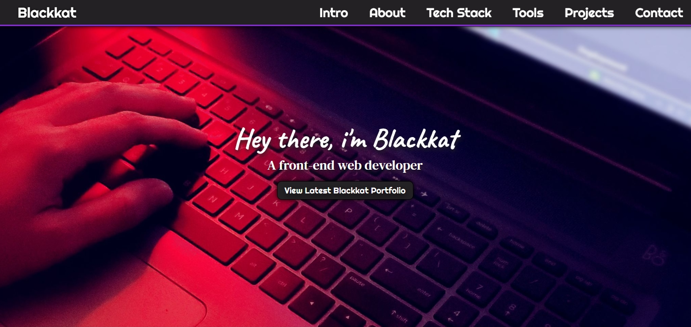

# 💼 Blackkat Personal Portfolio

## 📖 Overview
This is my first minimal personal portfolio, created as part of my FreeCodeCamp Responsive Web Design Certification. The objective was to build a fully responsive personal portfolio webpage using only HTML and CSS that showcases my projects, skills, and contact information.

I designed this portfolio under my developer alias, Blackkat, to relect both my professional work and creative flair. The project demonstrates navigation structure, responsive layout, section organization, and interactive styling. This portfolio serves as my temporary developer portfolio and includes a welcome section, about section, tech stack overview, tools and platforms I use, project previews, and contact links, all presented in a clean, accessible design.

## ✨ Features
- Fixed top navigation bar that remains visible while scrolling.
- Welcome section with full viewport height and intro text.
- About section introducing myself and my work.
- Tech stack and tools sections with categorized layouts.
- Projects section displaying previous FreeCodeCamp builds with preview images.
- External links to GitHub, LinkedIn, Facebook, Threads, and more.
- Responsive design with media queries for mobile, tablet, and desktop.
- Smooth scrolling navigation and hover effects throughout.

## 🛠️ Built With
- HTML – structure
- CSS – styling

## 🧰 Skills Demonstrated
- Semantic HTML structuring.
- Responsive web design using Flexbox and media queries.
- Fixed navigation bar implementation.
- Smooth scroll and anchor link navigation.
- Section-based design and content organization.
- Font Awesome icon usage and Google Fonts integration.
- Project gallery with linked previews.
- Gothic-inspired yet professional visual theme.

## 🚀 How to Use
[`View Live Project`](https://blackkat-dev.github.io/blackkat-personal-portfolio/)

1. Use the navbar to explore each section of the page.
2. Scroll through to view About, Skills, Tools, Projects, and contact sections.
3. Click on a project tile to visit the live project demos.
4. Use the contact links at the bottom to connect with me or view my GitHub and social profiles.
5. Resize the browser window to see responsive adjustments.

## 📂 Project Structure
blackkat-personal-portfolio/ | `root folder`

│── index.html | `main webpage`

│── css/ | `styling folder`

│   └── styles.css | `styling`

│── img/ | `images folder`

│   └── website-favicon.svg | `favicon`

│   └── website-preview.png | `preview image`

│   └── background-image.jpg | `hero background image`

│   └── blackkat-profile-picture.jpg | `Blackkat's aka Tiffany's photo`

│   └── band-website-in-the-shadows.png | `project preview`

│   └── technical-documentation-page.jpeg | `project preview`

│   └── survey-form.jpeg | `project preview`

│── LICENSE | `license details`

│── README.md | `project details`

## 📌 Learning Goals
- Build a professional developer portfolio using HTML and CSS.
- Create a full-page layout with sections for About, Projects, and Contact.
- Design a fixed navigation bar with smooth anchor navigation.
- Showcase previous FreeCodeCamp projects within a gallery.
- Apply media queries for responsiveness across all devices.

## 🎯 Certification Compliance
This project fully meets all FreeCodeCamp Responsive Web Design
Personal Portfolio user stories and requirements.

## 📸 Preview

[`View Live Project`](https://blackkat-dev.github.io/personal-portfolio-project/)

## 📄 License 
This project is provided for portfolio and educational review only. 
Copying, redistribution, or commercial use is prohibited. 

This project is licensed under a Blackkat Proprietary License. 
See the [LICENSE](https://github.com/blackkat-dev/personal-portfolio-project/blob/main/LICENSE) file for full terms.
